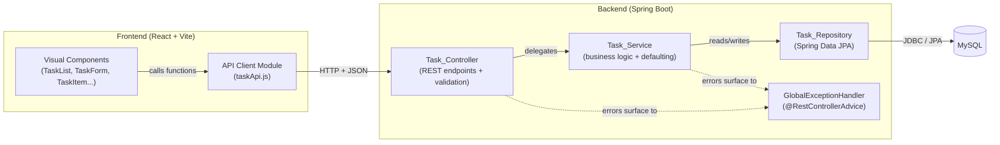
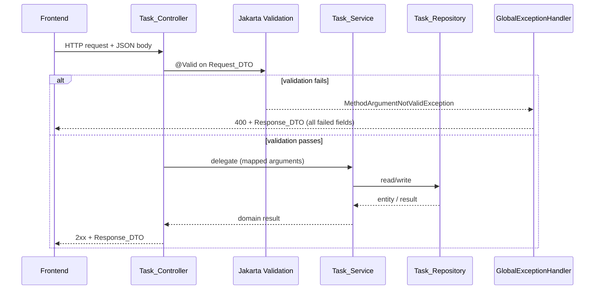
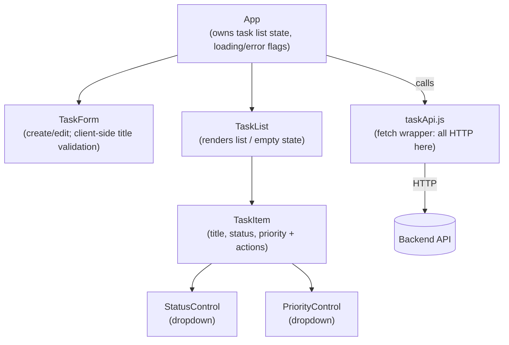

# Design Document

## Overview

DevTrack is a full-stack task management application split into two independently runnable parts:

- A **Backend** REST API (Java 21, Spring Boot, Maven, Spring Data JPA, MySQL) that owns all task data and business rules.
- A **Frontend** single-page application (React + Vite, JavaScript, functional components) that talks to the Backend over HTTP and renders the UI.

This version supports creating, listing, retrieving, editing, deleting tasks, plus dedicated operations to change a task's status and priority. Authentication, containers (Docker), and cloud services are out of scope (Requirement 10).

Because this is also a learning project, the design deliberately favors the simplest structure that satisfies the requirements. It uses the standard three-layer Spring layout (Controller → Service → Repository) and keeps the Frontend's network code separate from its visual components. Every non-obvious decision below includes a short rationale so a junior developer can follow the "why," not just the "what."

### How this maps to the requirements at a glance

| Area | Requirements |
| --- | --- |
| Task CRUD + status/priority operations | 1, 2, 3, 4, 5, 6, 7 |
| Layered backend, DTOs, validation, error handling | 8 |
| Frontend interface and behavior | 9 |
| Scope boundaries (no auth, host-runnable, local-only) | 10 |

## Architecture

DevTrack uses a classic layered backend behind a REST API, with a React SPA as the client and MySQL as the datastore.



### Layer responsibilities and rationale

The Controller → Service → Repository split (Requirement 8.1–8.3) exists to keep each concern in one place:

- **Task_Controller** — Maps HTTP requests to method calls, applies Jakarta Validation to the incoming `Request_DTO`, and translates results into HTTP responses with the right status codes. It contains **no business logic** and **never** touches the repository directly. *Rationale:* the controller is the "HTTP adapter." Keeping logic out of it means the rules can be unit-tested without spinning up the web layer, and the web layer can be tested without a database.
- **Task_Service** — Holds the business rules: defaulting omitted fields, trimming titles, applying partial updates for status/priority, and deciding when a task is missing (throwing a "not found" error). It calls the repository for persistence. *Rationale:* centralizing rules here means both the "full edit" and the "change status" paths share the same, single source of truth and are easy to test in isolation with a mocked repository.
- **Task_Repository** — A Spring Data JPA `interface` that persists `Task` records to MySQL (Requirement 8.6). *Rationale:* Spring Data generates the CRUD implementation from the interface, so we write no boilerplate SQL for standard operations. This is the "keep it simple" choice for a learning project.
- **GlobalExceptionHandler** — A single `@RestControllerAdvice` that converts exceptions (validation failures, not-found, malformed body, persistence failure) into a consistent `Response_DTO` with the correct status code (Requirement 8.7–8.10). *Rationale:* centralizing error handling avoids repeating try/catch in every controller method and guarantees a uniform error shape for the Frontend.

> **Junior-dev note — `@RestControllerAdvice`:** this is a Spring class whose methods run *after* a controller throws an exception. Each method is annotated with `@ExceptionHandler(SomeException.class)` and returns the response body + status for that error type. Think of it as a shared `catch` block for the whole API.

### Request lifecycle (validation before logic)

Requirement 8.5 requires validation to happen before the service is invoked, and the service must not run if validation fails. Spring gives us this for free with `@Valid`:



## Components and Interfaces

### Backend components

| Component | Type | Responsibility |
| --- | --- | --- |
| `TaskController` | `@RestController` | HTTP mapping, `@Valid` on request DTOs, status codes, delegation to service. |
| `TaskService` | `@Service` | Business logic: defaulting, trimming, partial updates, not-found detection. |
| `TaskRepository` | `interface extends JpaRepository<Task, Long>` | Persistence via Spring Data JPA. |
| `GlobalExceptionHandler` | `@RestControllerAdvice` | Uniform error responses. |
| `Task` | `@Entity` | JPA entity persisted to MySQL. |
| `TaskStatus`, `TaskPriority` | `enum` | Allowed status/priority values. |
| DTO classes | records | Request/response bodies (never expose the entity directly). |

### Service interface (conceptual)

The service exposes one method per task operation. Signatures use DTOs in and out so the entity never leaks past the service boundary (Requirement 8.4).

```java
public interface TaskService {
    TaskResponse create(CreateTaskRequest request);
    List<TaskResponse> listAll();                       // ordered by ascending id
    TaskResponse getById(Long id);                      // throws TaskNotFoundException
    TaskResponse update(Long id, UpdateTaskRequest req);// full replace; throws if missing
    TaskResponse changeStatus(Long id, ChangeStatusRequest req);
    TaskResponse changePriority(Long id, ChangePriorityRequest req);
    void delete(Long id);                               // throws if missing
}
```

*Rationale for `TaskNotFoundException`:* the service signals "missing task" by throwing a small custom exception rather than returning `null` or `Optional` to the controller. The controller stays thin, and the `GlobalExceptionHandler` maps this one exception type to HTTP 404 in a single place (Requirements 3.2, 4.4, 5.3, 6.3, 7.2).

### Why status and priority have dedicated endpoints (in addition to full edit)

The full edit endpoint (Requirement 4) **replaces all four fields** and applies defaults to any omitted field — that is its defined contract (4.2, 4.3). That makes it unsuitable for a small, targeted change:

- Changing only the status via full edit would force the client to resend title, description, and priority; any field the client forgot would be reset to its default, silently clobbering data.
- The status change (Requirement 5.2) and priority change (Requirement 6.1) must leave the *other* fields untouched.

So DevTrack provides two narrow endpoints (`PATCH .../status` and `PATCH .../priority`) whose only job is to update one field and preserve the rest. *Rationale:* this keeps the common UI actions ("move to In Progress", "raise priority") safe and one-purpose, and it maps cleanly to `PATCH` (partial update) versus `PUT` (full replace). It also gives the Frontend simple, single-value requests for the status dropdown and priority control (Requirements 9.7, 9.8).

## Data Models

### Task entity

The `Task` is the single persisted entity. Field constraints come straight from the Glossary and Requirement 1.

| Field | Type | Constraints / Default | Requirement |
| --- | --- | --- | --- |
| `id` | `Long` | Primary key, DB-generated (identity). | Task_Id |
| `title` | `String` | Required, 1–150 chars after trim. | 1.1, 1.5, 1.6 |
| `description` | `String` | Optional, ≤ 2000 chars; stored as `""` when omitted. | 1.4, 1.7 |
| `status` | `TaskStatus` | Enum; defaults to `TODO`. | 1.2 |
| `priority` | `TaskPriority` | Enum; defaults to `MEDIUM`. | 1.3 |

```java
@Entity
@Table(name = "tasks")
public class Task {

    @Id
    @GeneratedValue(strategy = GenerationType.IDENTITY)
    private Long id;

    @Column(nullable = false, length = 150)
    private String title;

    @Column(nullable = false, length = 2000)
    private String description = "";

    @Enumerated(EnumType.STRING)
    @Column(nullable = false, length = 20)
    private TaskStatus status = TaskStatus.TODO;

    @Enumerated(EnumType.STRING)
    @Column(nullable = false, length = 20)
    private TaskPriority priority = TaskPriority.MEDIUM;

    // getters/setters (or use a builder)
}
```

> **Junior-dev note — `@Enumerated(EnumType.STRING)`:** JPA can store an enum either as its ordinal number (0, 1, 2…) or as its name ("TODO", "DONE"). We store the **name**. Ordinals are fragile: if someone reorders the enum constants later, existing rows would suddenly mean something different. Storing the string keeps the database readable and reorder-safe.

> **Junior-dev note — `GenerationType.IDENTITY`:** the database assigns the `id` (MySQL `AUTO_INCREMENT`). We let MySQL own id generation so ids are unique and monotonic without application coordination, which also gives us the ascending-id ordering that Requirement 2.1 asks for.

### Enums

```java
public enum TaskStatus  { TODO, IN_PROGRESS, DONE }
public enum TaskPriority { LOW, MEDIUM, HIGH }
```

*Rationale:* using enums (not free-text strings) makes "must be one of…" (Requirements 1.8, 1.9, 5.4, 6.4) enforceable by the type system and by Jackson's JSON parsing. An unknown value fails to deserialize and becomes a 400 (see Error Handling).

### DTO definitions

DTOs are Java `record` types — immutable, concise, and ideal for data carriers. The entity is never serialized to or from JSON directly (Requirement 8.4).

**Requests**

```java
// Create: status/priority/description optional (defaulted by the service)
public record CreateTaskRequest(
    @NotBlank(message = "title is required")
    @Size(max = 150, message = "title must be at most 150 characters")
    String title,

    @Size(max = 2000, message = "description must be at most 2000 characters")
    String description,          // null => defaulted to ""

    TaskStatus status,           // null => defaulted to TODO
    TaskPriority priority        // null => defaulted to MEDIUM
) {}

// Full edit: same shape and rules as create (full replace + defaulting)
public record UpdateTaskRequest(
    @NotBlank(message = "title is required")
    @Size(max = 150, message = "title must be at most 150 characters")
    String title,
    @Size(max = 2000, message = "description must be at most 2000 characters")
    String description,
    TaskStatus status,
    TaskPriority priority
) {}

// Targeted updates
public record ChangeStatusRequest(
    @NotNull(message = "status is required") TaskStatus status
) {}

public record ChangePriorityRequest(
    @NotNull(message = "priority is required") TaskPriority priority
) {}
```

**Responses**

```java
public record TaskResponse(
    Long id,
    String title,
    String description,
    TaskStatus status,
    TaskPriority priority
) {}

// Uniform error body (used by the GlobalExceptionHandler)
public record ErrorResponse(
    int status,             // e.g. 400
    String message,         // human-readable summary
    List<FieldError> errors // per-field details; empty for non-validation errors
) {
    public record FieldError(String field, String message) {}
}
```

> **Junior-dev note — trim rules and `@NotBlank`/`@Size`:** `@NotBlank` rejects null, empty, and whitespace-only strings (covers 1.5). `@Size(max = 150)` bounds the length. The requirement says the 1–150 bound applies *after trimming*. Bean Validation's `@Size` counts raw characters, so the service trims the title before saving, and we add a small custom check (or trim-then-validate in the service) so a title that is ≤150 only because of trailing spaces is judged on its trimmed length (1.6, 4.6). Keeping the trim in the service keeps the "what counts as valid" rule in one testable place.

## Correctness Properties

*A property is a characteristic or behavior that should hold true across all valid executions of a system — essentially, a formal statement about what the system should do. Properties serve as the bridge between human-readable specifications and machine-verifiable correctness guarantees.*

The properties below were derived from the acceptance-criteria prework and consolidated to remove redundancy. Several criteria repeat the same rule across the create and edit endpoints (for example, the title bounds appear in both Requirement 1 and Requirement 4); those are expressed once as a property that ranges over the applicable write operations. UI-rendering criteria (Requirement 9) and environment/scope criteria (Requirement 10) are covered by unit/component and integration tests rather than properties (see Testing Strategy).

### Property 1: Write-then-read round trip preserves values

*For any* valid write request (create or full edit), reading the resulting task back by its id returns exactly the field values that were written (with omitted optional fields resolved to their defaults).

**Validates: Requirements 1.1, 3.1, 4.1, 4.2**

### Property 2: Omitted optional fields take their defaults

*For any* create or full-edit request that omits status, description, or priority, the stored task has status `TODO`, description `""`, and priority `MEDIUM` respectively for each omitted field.

**Validates: Requirements 1.2, 1.3, 1.4, 4.3**

### Property 3: Title must be non-blank and within 1–150 characters after trimming

*For any* create or full-edit request whose title is missing, whitespace-only, or whose trimmed length is outside 1–150, the Backend rejects the request with HTTP 400 and does not persist a task.

**Validates: Requirements 1.5, 1.6, 4.5, 4.6**

### Property 4: Description must not exceed 2000 characters

*For any* create or full-edit request whose description length exceeds 2000, the Backend rejects the request with HTTP 400 and does not persist a task.

**Validates: Requirements 1.7, 4.7**

### Property 5: Status and priority must be valid enum values

*For any* create, full-edit, change-status, or change-priority request carrying a status or priority value that is not one of the allowed enum names, the Backend rejects the request with HTTP 400.

**Validates: Requirements 1.8, 1.9, 4.8, 4.9, 5.4, 6.4**

### Property 6: A rejected or invalid write does not change stored state

*For any* write request (create, edit, change-status, change-priority) that is rejected for a validation reason, the set of stored tasks and their field values are identical before and after the request; in particular no id is assigned on a rejected create.

**Validates: Requirements 1.10, 5.4, 6.4, 8.11**

### Property 7: Targeted updates change only their target field

*For any* existing task, a change-status request updates only the status (leaving title, description, priority unchanged) and a change-priority request updates only the priority (leaving title, description, status unchanged); the change persists to subsequent reads.

**Validates: Requirements 5.1, 5.2, 6.1, 6.2**

### Property 8: Operations on an absent id return 404

*For any* well-formed id that is not currently stored, a get, edit, change-status, change-priority, or delete request returns HTTP 404 and leaves storage unchanged.

**Validates: Requirements 3.2, 4.4, 5.3, 6.3, 7.2**

### Property 9: Delete makes a task absent

*For any* existing task, deleting it returns HTTP 204 and every subsequent get for that id returns HTTP 404.

**Validates: Requirements 7.1**

### Property 10: Listing returns all tasks ordered by ascending id

*For any* set of created tasks, a list request returns a collection containing every stored task exactly once, in strictly ascending id order.

**Validates: Requirements 2.1, 2.2**

### Property 11: Every task view includes all five fields

*For any* task returned by a list or get operation, the Response_DTO includes the id, title, description, status, and priority, each equal to the task's stored value.

**Validates: Requirements 2.3, 3.1**

### Property 12: A validation error reports every failed field

*For any* request that violates validation on a set of fields, the 400 error Response_DTO names exactly that set of fields (not merely the first one).

**Validates: Requirements 8.7, 8.9**

## Error Handling

All errors flow through the single `GlobalExceptionHandler` and produce the `ErrorResponse` shape, so the Frontend always parses one consistent body (Requirement 8.7–8.10). No stack traces or internal class names are exposed (Requirements 8.8, 8.10).

| Situation | Exception caught | HTTP status | Body |
| --- | --- | --- | --- |
| DTO fails Jakarta Validation | `MethodArgumentNotValidException` | 400 | `ErrorResponse` listing **every** failed field + reason (8.7, 8.9, Property 12) |
| Malformed / unparseable / missing body; invalid enum value in JSON | `HttpMessageNotReadableException` | 400 | `ErrorResponse` with a generic "request body could not be parsed" message (1.11, 8.8) |
| Malformed path id (e.g. `/tasks/abc`) | `MethodArgumentTypeMismatchException` | 400 | `ErrorResponse` with a generic "invalid identifier" message (3.3, 7.3) |
| Task not found | `TaskNotFoundException` (custom) | 404 | `ErrorResponse` describing the missing task (3.2, 4.4, 5.3, 6.3, 7.2) |
| MySQL unavailable / persistence failure | `DataAccessException` | 500 | `ErrorResponse` with a generic "operation could not be completed" message (8.10) |

> **Junior-dev note — why invalid enums land in `HttpMessageNotReadableException`:** when JSON like `"status":"NOPE"` arrives, Jackson (the JSON library) fails to convert `"NOPE"` into a `TaskStatus` while it is still *reading* the body, before `@Valid` runs. Spring wraps that as `HttpMessageNotReadableException`. So Requirements 1.8/1.9/4.8/4.9 are satisfied at the parsing layer, and we return 400 from the same handler that covers malformed bodies.

**Atomicity (Requirement 8.11 / Property 6):** each write operation runs in a single `@Transactional` service method. If persistence throws after validation, the transaction rolls back, so no partial changes remain. *Rationale:* `@Transactional` lets Spring manage the commit/rollback boundary for us instead of hand-writing rollback logic — the simplest correct approach.

## Frontend Design

The Frontend is a small React (Vite) SPA using only functional components (Requirement 9.12). Network code is isolated in a dedicated API module so components stay focused on rendering (Requirement 9.11).

### Module and component structure



| File | Responsibility | Requirement |
| --- | --- | --- |
| `src/api/taskApi.js` | All HTTP calls (`listTasks`, `getTask`, `createTask`, `updateTask`, `changeStatus`, `changePriority`, `deleteTask`); throws a normalized error on non-2xx. | 9.11 |
| `src/App.jsx` | Holds task list, `loading`, and `error` state; orchestrates load and mutations. | 9.1, 9.3, 9.10 |
| `src/components/TaskForm.jsx` | Create/edit form; trims and validates the title *before* calling the API. | 9.4, 9.5, 9.6 |
| `src/components/TaskList.jsx` | Renders tasks or the empty-state message. | 9.1, 9.2 |
| `src/components/TaskItem.jsx` | One task row with status/priority controls and delete. | 9.7, 9.8, 9.9 |
| `src/components/StatusControl.jsx`, `PriorityControl.jsx` | Small reusable dropdowns for the enum values. | 9.7, 9.8 |

*Rationale for the split:* `taskApi.js` is the only place that knows about URLs, HTTP methods, and status codes. Components receive plain data and callbacks. This keeps components easy to read and lets us change the transport (e.g. swap `fetch` for `axios`) without touching the UI (Requirement 9.11). The small `StatusControl`/`PriorityControl` components are reused by both the row actions and the form, avoiding duplicated option lists (reusable-components guidance).

### UI states

The Frontend explicitly handles three list states (Requirements 9.1–9.3):

- **Loading:** while the initial `listTasks()` call is in flight, show a lightweight loading indicator.
- **Empty:** on an empty array, show "No tasks yet" and render no task rows (9.2).
- **Error:** if the list request fails, show a failure message and render no rows (9.3). For a *mutation* failure, show the error message but keep the previously displayed list unchanged (9.10).

**Client-side title validation (9.5):** `TaskForm` trims the title and blocks submission with an inline message if it is empty, without calling the Backend. *Rationale:* this gives instant feedback and avoids a guaranteed-to-fail round trip, while the Backend still enforces the same rule authoritatively (defense in depth — never trust the client alone).

## Testing Strategy

DevTrack uses a **dual approach**: property-based tests for the universal correctness rules, and example/unit/integration tests for specific scenarios, framework wiring, and infrastructure paths.

### Property-based testing (Backend business logic)

Property-based testing (PBT) applies here because the core create/edit/status/priority logic is effectively a set of pure transformations and invariants over a large input space (titles of any length/whitespace, any enum value, any set of stored tasks). PBT exercises many generated inputs to surface edge cases that example tests miss.

- **Library:** [jqwik](https://jqwik.net/) — a JUnit 5 property-testing engine for Java. We use it rather than writing generators from scratch.
- **Scope:** properties run against the `TaskService` with an in-memory fake/`@DataJpaTest` repository (fast, no external MySQL), so they test *our* logic, not the database engine.
- **Iterations:** each property test runs a minimum of **100 generated cases** (`@Property(tries = 100)` or higher).
- **Traceability:** each test is tagged with a comment in the form
  `// Feature: devtrack-task-management, Property {number}: {property_text}`
  and implements exactly one property from the Correctness Properties section (Properties 1–12).

Example generators: valid/invalid titles (including whitespace-only, boundary lengths 150/151), descriptions at boundary 2000/2001, all enum values plus invalid enum strings, and random multisets of tasks for the list-ordering property.

### Unit tests (example-based)

Focused JUnit 5 tests for behaviors that are specific rather than universal, or that are cheaper to pin down with concrete cases:

- `TaskService` defaulting and trimming on representative inputs.
- Mapping between entity and `TaskResponse`.
- `TaskNotFoundException` thrown for missing ids (concrete example backing Property 8).

### Web-layer tests (controller / `@WebMvcTest`)

These test the HTTP contract with a **mocked** `TaskService`, so they verify wiring and status codes without a database:

- Malformed / missing JSON body → 400 parse error (1.11, 8.8).
- Malformed path id `/tasks/abc` → 400 (3.3, 7.3).
- Invalid enum in body → 400 (spot-check of Property 5 at the HTTP layer).
- Validation failure returns 400 and the service mock is **never called** (8.5) and the error body lists all failed fields (8.7 — complements Property 12).
- Correct status codes per endpoint: 201 create, 200 read/edit/status/priority, 204 delete.
- Persistence failure: mock service throws `DataAccessException` → 500 generic body (8.10).
- A request carrying an `Authorization` header behaves identically to one without (10.1, 10.2).

### Integration test (persistence wiring)

A small number of `@DataJpaTest` (or full-context) tests confirm the `TaskRepository` actually persists to and reads from the JPA layer, and that listing returns ascending-id order end to end (8.6, 2.1). These are not property tests — they verify infrastructure wiring with 1–3 representative cases.

### Frontend tests

- **Component tests** (React Testing Library): empty-state renders the "no tasks" message and no rows (9.2); error-state renders the failure message (9.3); a failed mutation keeps the prior list (9.10); `TaskForm` blocks submission of a blank/whitespace title and shows an inline message without calling the API (9.5).
- **API module tests:** `taskApi.js` functions call the expected URL/method and normalize non-2xx responses into thrown errors (9.11), with `fetch` mocked.

*Why no property tests on the Frontend:* UI rendering and interaction are not a good fit for PBT (there is no meaningful "for all inputs" over a rendered DOM). The one candidate — client-side title trimming — duplicates the Backend title rule already covered by Property 3, so it is verified with focused component tests instead.

### Out-of-scope / environment criteria (Requirement 10)

Requirements 10.3 and 10.4 (runnable on the host without a container, local-only components) are satisfied by project setup and verified by running the Backend, Frontend, and a local MySQL directly during development, not by automated tests.
